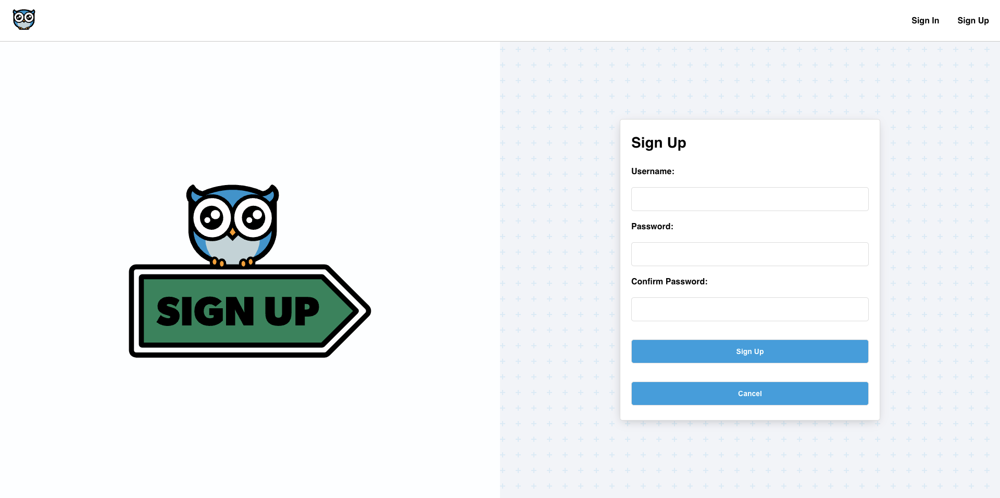

  

  # Hoot-Tweets

  ### [CLICK TO DEMO](https://hoot-tweet.netlify.app/hoots)

  ##### Amogh Maheshwari

  

  ## :pencil: Description

  - Hoot is an all-in-one platform that allows users to share their opinion(s)in a dedicatedsafe and inclusive space.
  - Users can add blog posts and comments starting friendly discussions organized by topic all in one place making blogging easiear to manage!
  - Built using Mongo, Node.js and Express.js on the back-end and React on the front-end, with a focus on a user-friendly interface to make blogging fun.

  ## :mountain: Background

  - The goal was to create a modern blogging application utilizing the MERN stack. 
  - The project establishes full crud and allows users to add comments on each others blogged posts (hoots)

  
 Planning 

  <a href="https://trello.com/b/1YuO2Xzz/hoot">Click to see my trello</a>

  ## :camera_flash: Screenshots 

  | Description               | Screenshot                                               |
  |:-------------------------:|----------------------------------------------------------|
  | **Landing Page**          |                      |
  | **Sign up Page**          |                    |
  | **Sign in Page**          |                    |
  | **Dashboard**             |                    |
  | **List Page**             |                           |
  | **Form Page**             |                              |
  | **Details Page**          |                   |

## :desktop_computer: Technologies Used

## :satellite: Future Goals

- [ ] Organize hoots based on topic
- [ ] Add comment edit functionality
- [ ] Allow for commenting on comments of other users

## Additional Formation

  
How to get started to run this on your machine

  :wrench: How to Run This Project Locally

Prerequisites

Node.js installed on your machine

MongoDB installed and running locally or a connection URI for a hosted MongoDB instance

Backend Setup

Clone the backend repository: git clone <https://github.com/amomack123/express-api-hoot-back-end>

Navigate to the backend directory: cd backend

Install dependencies: npm install

Set up your environment variables in a .env file:
MONGO_URI=your_mongo_connection_uri
JWT_SECRET=your_jwt_secret

Start the backend server: npm start

Frontend Setup

Clone the frontend repository: https://github.com/amomack123/react-hoot-front-end

Navigate to the frontend directory: cd frontend

Install dependencies: npm install

VITE_EXPRESS_BACKEND_URL=http://localhost:5000

Start the development server: npm run dev

The frontend will run on http://localhost:3000 by default.

Access the App

Open your browser and navigate to http://localhost:3000 to view the frontend.

Ensure the backend is running to handle API requests.

